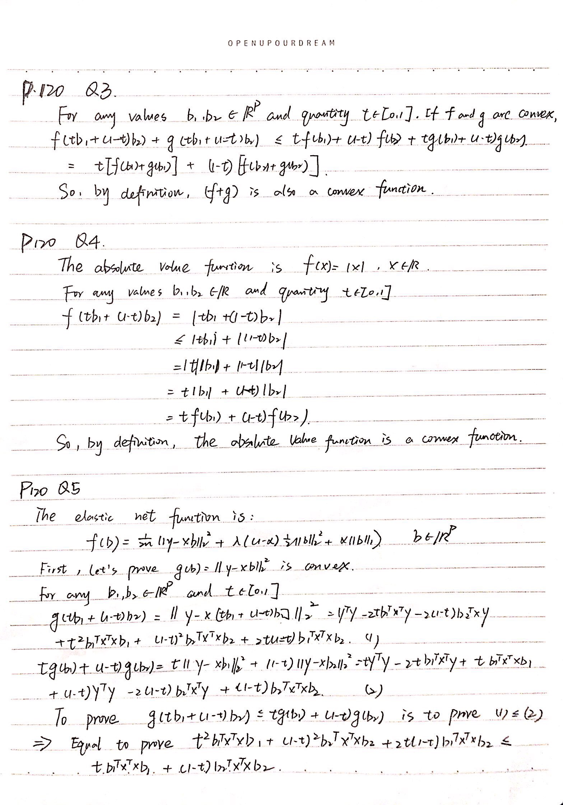
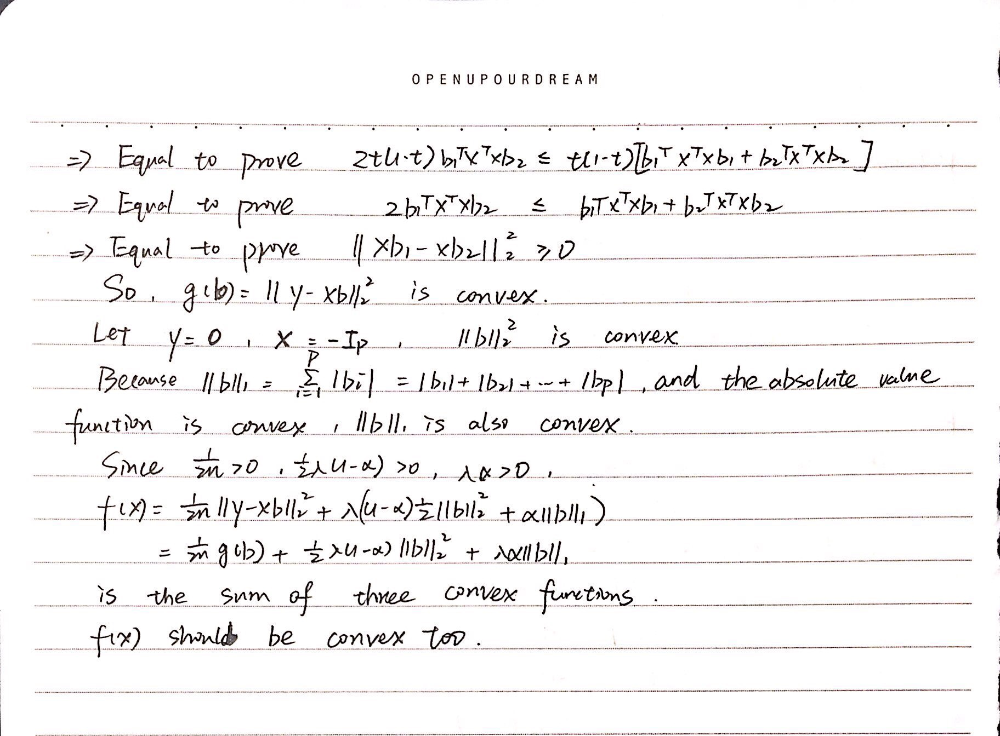

```{r setup, include = FALSE}
knitr::opts_chunk$set(
  fig.width = 5,
  fig.height = 4,
  collapse = TRUE,
  comment = "#>"
)
```

## P117 Q7
The function "kernel_density" below accepts a training vector x, bandwidth h, and a testing vector x_new, and it returns the kenel density estimate with the Epanechnikov kernel at each x_new value.

```{r}
kernel_density <- function(x, h, x_new){
  den <- rep(0, times = length(x_new))
  for (i in seq_along(x_new)){
    xx <- (x - x_new[i])/h
    ind <- as.numeric(abs(xx) <= 1)
    den[i] <- mean(3/4*(1 - xx^2)*ind)/h
  }
  return(den)
}
```

Now, let's test how this function works for some hand constructed datasets under different pdfs.

```{r}
set.seed(2222)
# Normal distriburion
x <- rnorm(1000, 0, 1)
x_new <- seq(-3, 3, length.out = 100)
den <- kernel_density(x, h = 0.5, x_new)
plot(x_new, den, type = "l", ylim = c(0, 0.5), ylab = "density", xlab = "")
trueden <- dnorm(x_new, 0, 1)
points(x_new, trueden, type = "l", col = "red")
legend("topright", legend = c("kernel density","true density"), 
       lty = c(1, 1), col = c("black", "red"), cex = 0.8)
title("Normal Distribution N(0,1)")

# Beta distribution
x <- rbeta(1000, 2, 5)
x_new <- seq(0, 1, length.out = 100)
den <- kernel_density(x, h = 0.1, x_new)
plot(x_new, den, type = "l", ylim = c(0, 2.5), ylab = "density", xlab = "")
trueden <- dbeta(x_new, 2, 5)
points(x_new, trueden, type = "l", col = "red")
legend("topright", legend = c("kernel density","true density"), 
       lty = c(1, 1), col = c("black", "red"), cex = 0.8)
title("Beta Distribution Beta(2,5)")

# Gamma distribution
x <- rgamma(1000, 2, 2)
x_new <- seq(0, 5, length.out = 100)
den <- kernel_density(x, h = 0.3, x_new)
plot(x_new, den, type = "l", ylim = c(0, 1), ylab = "density", xlab = "")
trueden <- dgamma(x_new, 2, 2)
points(x_new, trueden, type = "l", col = "red")
legend("topright", legend = c("kernel density","true density"), 
       lty = c(1, 1), col = c("black", "red"), cex = 0.8)
title("Gamma Distribution Gamma(2,2)")
```

And then, let's see how the function performs under different bandwiths h. Here, we use normal distribution N(0,1) as an example.

```{r}
set.seed(2222)
x <- rnorm(1000, 0, 1)
x_new <- seq(-3, 3, length.out = 100)

# h=0.1
den <- kernel_density(x, h = 0.1, x_new)
plot(x_new, den, type = "l", ylim = c(0, 0.5), ylab = "density", xlab = "")
trueden <- dnorm(x_new, 0, 1)
points(x_new, trueden, type = "l", col = "red")
legend("topright", legend = c("kernel density","true density"), 
       lty = c(1, 1), col = c("black", "red"), cex = 0.8)
title("N(0,1), h=0.1")

#h=0.5
den <- kernel_density(x, h = 0.5, x_new)
plot(x_new, den, type = "l", ylim = c(0, 0.5), ylab = "density", xlab = "")
trueden <- dnorm(x_new, 0, 1)
points(x_new, trueden, type = "l", col = "red")
legend("topright", legend = c("kernel density","true density"), 
       lty = c(1, 1), col = c("black", "red"), cex = 0.8)
title("N(0,1), h=0.5")

#h=2
den <- kernel_density(x, h = 2, x_new)
plot(x_new, den, type = "l", ylim = c(0, 0.5), ylab = "density", xlab = "")
trueden <- dnorm(x_new, 0, 1)
points(x_new, trueden, type = "l", col = "red")
legend("topright", legend = c("kernel density","true density"), 
       lty = c(1, 1), col = c("black", "red"), cex = 0.8)
title("N(0,1), h=2")
```

## P120 Q3,4,5

{width=80%}
{width=80%}

## P120 Q6
The KKT condition for glmnet when $0<\alpha\le1$ is $\frac{1}{n}\sum_{i=1}^n(x_{il}(y_i-\sum_{j=1}^px_{ij}\hat{b_j}))-\lambda(1-\alpha)\hat{b_l}=\lambda\alpha s_l$  

for $l=1, 2, ..., p$ where  
\begin{equation}
s_l \in
\left\{
    \begin{array}{lr}
      \qquad 1, & if \quad \hat{b_l}>0  \\
      \quad -1, & if \quad \hat{b_l}<0\\
      [-1,1], & if \quad \hat{b_l}=0 
    \end{array}
\right.
\end{equation}


The function "lasso_reg_with_screening" shown below accepts a design matrix X, a response vector y, a current coefficient vector b, a new penalty term lambda, and alpha, and it returns a logical vector indicating all the current zero coefficients which violate the KKT condition.

```{r}
lasso_reg_with_screening <- function(X, y, b, lambda, alpha){
  s <- rep(0, times = length(b))
  res <- y - X %*% b
  for (j in seq_along(b))
    s[j] <- (sum(X[, j]*res)/length(y) - lambda*(1 - alpha)*b[j])/(lambda*alpha)
  val <- (b == 0) & (abs(s) >= 1)
  return(val)
}
```

Now, let's test how the function works.

```{r}
set.seed(2222)
# Generate a random design matrix X
n <- 500L
p <- 1000L
X <- matrix(rnorm(n*p), nrow = n)
# Generate the real coefficient vector b with only the first ten numbers lager than zero
b <- c(seq(1, 0.1, length.out = 10L), rep(0, times = p - 10L))
# Generate the response vector y
y <- X %*% b +rnorm(n, mean = 0, sd = 0.1)
# Generate the current coefficient vector b_cur
b_cur <- rep(0, times = p)
# Show which current zero coefficients violate the KKT conditions
which(lasso_reg_with_screening(X, y, b_cur, lambda = 0.8, alpha = 0.8))
```